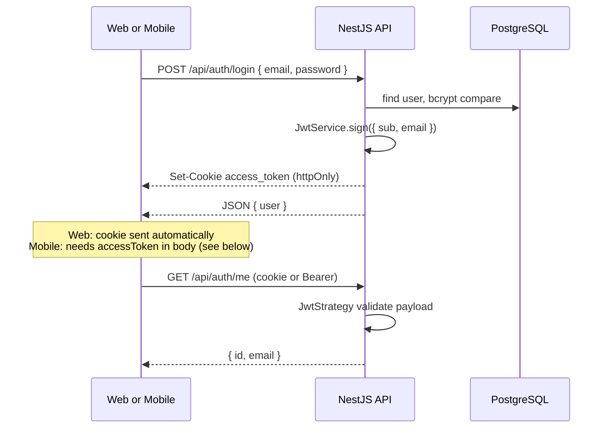

# Jobtracker — Authentication

This document describes how authentication works in the Jobtracker monorepo today, so other clients (e.g. **mobile**, another Cursor workspace) can integrate with the same API without guessing.

**Stack:** NestJS API (`api/`) + Vite React web client (`client/`). There is **no mobile app in this repo yet**; mobile should use the same API routes described below.

---

## Quick reference

| Item | Value |
|------|--------|
| API base URL (local) | `http://localhost:3000/api` |
| Global prefix | `/api` (set in `api/src/main.ts`) |
| Auth routes prefix | `/api/auth` |
| JWT secret env | `JWT_SECRET` |
| Token lifetime env | `JWT_EXPIRES_IN` (default `1d`) |
| Cookie name | `access_token` |
| Protected routes guard | `JwtAuthGuard` (Passport JWT) |

---

## Architecture



**Single source of truth:** `AuthService` (`api/src/modules/auth/auth.service.ts`) — register, login, password hashing, JWT signing.

**HTTP layer:** `AuthController` (`api/src/modules/auth/auth.controller.ts`) — cookies + JSON responses.

**Do not duplicate** auth business logic in another controller/service unless you have a very different flow (e.g. OAuth). Mobile and web share **`AuthService`**.

---

## How the JWT is accepted

`JwtStrategy` (`api/src/modules/auth/jwt.strategy.ts`) reads the token from **either**:

1. **Cookie:** `access_token` (httpOnly) — used by the web app  
2. **Header:** `Authorization: Bearer <accessToken>` — intended for mobile / API tools  

JWT payload shape:

```ts
{ sub: number; email: string }  // sub = user id
```

After validation, `req.user` is:

```ts
{ id: number; email: string }
```

---

## API endpoints

All paths are under `{BASE}/api/auth` where `BASE` is e.g. `http://localhost:3000`.

### `POST /auth/register`

**Body (`RegisterDto`):**

```json
{
  "email": "user@example.com",
  "name": "Jane Doe",
  "password": "password123"
}
```

**Validation:**

- `email` — valid email, required  
- `name` — string, required  
- `password` — string, 8–32 chars, required  

**Success (201/200):**

- Sets httpOnly cookie `access_token` with JWT  
- Response body (today):

```json
{
  "user": { "id": 1, "email": "user@example.com" }
}
```

**Errors:**

- `409 Conflict` — email already in use  

---

### `POST /auth/login`

**Body (`LoginDto`):**

```json
{
  "email": "user@example.com",
  "password": "password123"
}
```

**Validation:** same password rules as register (8–32 chars).

**Rate limit:** 10 requests / 60 seconds per throttle config on this route.

**Success:**

- Sets httpOnly cookie `access_token`  
- Response body (today):

```json
{
  "user": { "id": 1, "email": "user@example.com" }
}
```

**Errors:**

- `401 Unauthorized` — `{ "message": "Invalid credentials", "statusCode": 401 }` (generic message for wrong email or password)

---

### `GET /auth/me`

**Auth required:** yes (`JwtAuthGuard`)

**Success:**

```json
{
  "id": 1,
  "email": "user@example.com"
}
```

**Errors:**

- `401 Unauthorized` — missing/invalid/expired token  

---

### `POST /auth/logout`

**Auth required:** yes

**Success:**

- Clears `access_token` cookie  
- `{ "message": "Logged out" }`  

Mobile should also delete locally stored token after calling this (with Bearer header).

---

## Cookie details (web)

| Property | Dev | Production (`NODE_ENV=production`) |
|----------|-----|-------------------------------------|
| Name | `access_token` | same |
| `httpOnly` | `true` | `true` |
| `secure` | `false` | `true` |
| `sameSite` | `lax` | `strict` |
| `path` | `/` | `/` |
| `maxAge` | derived from `JWT_EXPIRES_IN` | same |

Implementation: `api/src/modules/auth/auth-cookie.util.ts`, constant in `api/src/modules/auth/auth.constants.ts`.

---

## Web client (`client/`)

**HTTP client:** `client/src/lib/http.ts`

- `baseURL`: `VITE_API_URL` + `/api` (default `http://localhost:3000/api`)
- **`withCredentials: true`** — required so the browser sends the `access_token` cookie

**Login flow:**

1. `POST /auth/login` with `{ email, password }`  
2. Cookie is stored by the browser automatically  
3. `GET /auth/me` (or invalidate `['auth', 'me']` query) to load the user  

**Session check:** `client/src/contexts/auth-context.tsx` — React Query `queryKey: ['auth', 'me']`.

**Route protection:** `client/src/app/(auth)/_guards/auth-guard.tsx` — redirects to `/login` if not authenticated.

**Logout:** `POST /auth/logout` + clear client state + navigate to `/login`.

### Web caveat: `/auth/refresh`

The axios interceptor in `client/src/lib/http.ts` calls `POST /auth/refresh` on 401. **That endpoint does not exist on the API yet.** Refresh is not implemented; expired tokens will fail until the user logs in again.

---

## Mobile client (not in repo — integration guide)

Use the **same routes and request bodies** as web. Differences are only on the **client side** and one **recommended API tweak**.

### What works today without API changes

- `POST /api/auth/login` and `/register` with JSON body  
- `JwtStrategy` already accepts **`Authorization: Bearer <token>`**  
- `GET /api/auth/me`, `POST /api/auth/logout`, and all `/api/users/*` routes use `JwtAuthGuard`  

### What does **not** work today for mobile

Login/register **do not return `accessToken` in the JSON body**. The token is only placed in an **httpOnly cookie**, which native apps do not use the same way as a browser.

`AuthService` already produces `accessToken` internally; the controller only returns `{ user }`:

```ts
// auth.controller.ts (current)
const { accessToken, user } = await this.authService.login(dto);
setAccessTokenCookie(res, this.config, accessToken);
return { user };  // accessToken omitted from body
```

### Recommended API change (no new route required)

Update `login` and `register` responses to:

```json
{
  "user": { "id": 1, "email": "user@example.com" },
  "accessToken": "eyJhbGciOiJIUzI1NiIsInR5cCI6IkpXVCJ9..."
}
```

Keep `setAccessTokenCookie()` so the web app keeps working unchanged.

**You do not need** a separate controller or service for mobile unless you want a different contract later.

### Mobile implementation checklist

1. **Base URL** — not `localhost` on a physical device; use machine IP or emulator alias (e.g. Android emulator `http://10.0.2.2:3000/api`).  
2. **Login** — `POST /api/auth/login` with `{ email, password }`.  
3. **Store token** — save `accessToken` from response (SecureStore / Keychain). *Blocked until API returns it in body.*  
4. **Authenticated requests** — header: `Authorization: Bearer ${accessToken}`.  
5. **Current user** — `GET /api/auth/me`.  
6. **Logout** — delete local token + `POST /api/auth/logout` with Bearer header.  
7. **CORS** — not applicable to native HTTP clients; browser CORS is configured in `api/src/main.ts` for web only.

### Example (fetch)

```ts
const API = 'http://YOUR_HOST:3000/api';

async function login(email: string, password: string) {
  const res = await fetch(`${API}/auth/login`, {
    method: 'POST',
    headers: { 'Content-Type': 'application/json' },
    body: JSON.stringify({ email, password }),
  });
  if (!res.ok) throw new Error('Login failed');
  const data = await res.json();
  // After API change: await secureStore.set('accessToken', data.accessToken);
  return data;
}

async function getMe(token: string) {
  const res = await fetch(`${API}/auth/me`, {
    headers: { Authorization: `Bearer ${token}` },
  });
  if (!res.ok) throw new Error('Unauthorized');
  return res.json();
}
```

---

## Other protected APIs

| Module | Guard | Prefix |
|--------|--------|--------|
| Users | `JwtAuthGuard` on controller | `/api/users` |

All user CRUD requires the same cookie or Bearer token as `/auth/me`.

---

## Environment variables

From repo root `.env` / `.env.example`:

```env
JWT_SECRET=change-me-to-a-long-random-string
JWT_EXPIRES_IN=1d
CORS_ORIGIN=http://localhost:5173,http://127.0.0.1:5173
```

Docker API service also receives these via `docker-compose.yml`.

---

## Source file map

| Purpose | Path |
|---------|------|
| Routes | `api/src/modules/auth/auth.controller.ts` |
| Business logic | `api/src/modules/auth/auth.service.ts` |
| JWT validation | `api/src/modules/auth/jwt.strategy.ts` |
| Guard | `api/src/modules/auth/jwt-auth.guard.ts` |
| Cookies | `api/src/modules/auth/auth-cookie.util.ts` |
| DTOs | `api/src/modules/auth/dto/login.dto.ts`, `register.dto.ts` |
| Types | `api/src/modules/auth/types/` |
| CORS + cookies middleware | `api/src/main.ts` |
| Web HTTP | `client/src/lib/http.ts` |
| Web auth state | `client/src/contexts/auth-context.tsx` |

---

## Error response format

NestJS default validation / HTTP errors:

```json
{
  "statusCode": 400,
  "message": ["password must be longer than or equal to 8 characters"],
  "error": "Bad Request"
}
```

Or a single string for `UnauthorizedException` / `ConflictException`.

---

## Security notes

- Passwords are hashed with **bcrypt** (10 rounds) before storage.  
- Login errors use a **generic** message (`Invalid credentials`) to avoid email enumeration.  
- JWT is signed with `JWT_SECRET`; do not commit real secrets.  
- Web relies on **httpOnly** cookies to reduce XSS token theft; mobile should use secure storage, not AsyncStorage for production tokens if possible.

---

## Summary for another Cursor agent

1. **Same API** for web and mobile: `/api/auth/login`, `register`, `me`, `logout`.  
2. **Same `AuthService`** — do not fork auth logic without a strong reason.  
3. **Web** = cookie + `withCredentials`.  
4. **Mobile** = Bearer header; **extend login/register JSON to include `accessToken`** (controller-only change).  
5. **No `/auth/refresh` yet** — plan for re-login on expiry until implemented.  
6. **Protected resources** = any route behind `JwtAuthGuard`.
