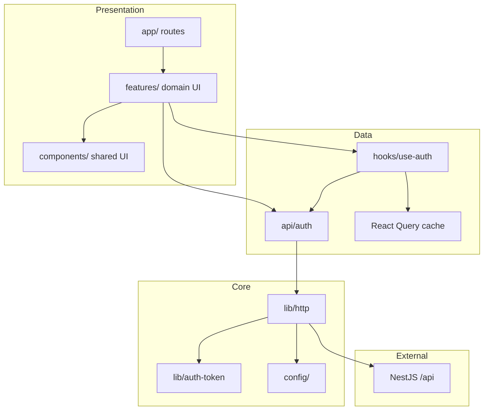
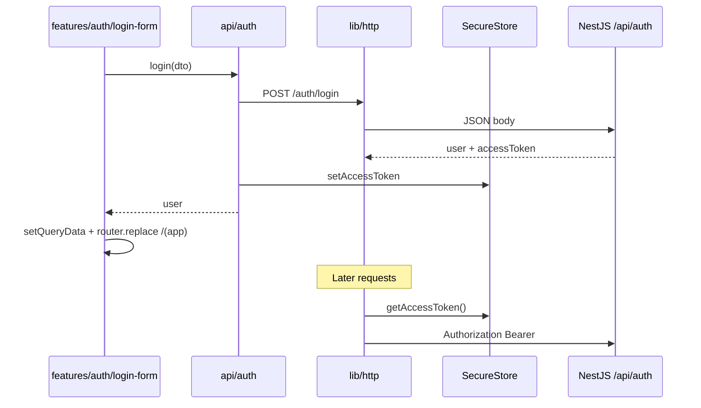

# Jobtracker Mobile — Architecture & Folder Structure

This document defines how the **Expo (React Native)** app is structured. It is the implementation blueprint for agents and developers.

**Related docs**

| Document | Purpose |
|----------|---------|
| [`Plan.md`](../Plan.md) | Backend auth contract, API routes, mobile integration checklist |
| This file | Mobile app layers, folders, conventions, phased rollout |

**Stack:** Expo SDK 56 · Expo Router · TypeScript · Axios · TanStack Query · Expo SecureStore

---

## 1. Design principles

1. **Same API as web** — Use `/api/auth/*` and Bearer tokens per `Plan.md`. No forked auth logic on mobile.
2. **Thin routes, thicker features** — `app/` files are screens/layouts only; domain UI lives in `features/{domain}/`.
3. **Shared vs domain** — Reuse `components/`, `hooks/`, `constants/` globally; keep auth-only or app-only UI under `features/`.
4. **Unidirectional dependencies** — `app` → `features` → `api` / `hooks` → `lib` / `config`. Never import `app` from `lib` or `api`.
5. **Types at API edges** — Request/response types in `api/{domain}/auth-dto.ts` (or `*-dto.ts`).
6. **One HTTP client** — `src/lib/http.ts` with auth interceptors.
7. **Secure token storage** — JWT in Expo SecureStore (`lib/auth-token.ts`), not AsyncStorage.
8. **Env for URLs only** — `EXPO_PUBLIC_API_URL`; secrets stay on the server.

---

## 2. High-level architecture



### Layer responsibilities

| Layer | Responsibility | May import |
|-------|----------------|------------|
| **app/** | Routes, layouts, redirects | `features/*`, `components/*`, `hooks/*`, `providers/*` |
| **features/{domain}/** | Domain screens/widgets (login form, tabs, home widgets) | `components/*`, `hooks/*`, `api/*`, `constants/*` |
| **components/** | Shared presentational UI | `hooks/*`, `constants/*` |
| **hooks/** | Shared React logic (`use-auth`, `use-theme`, …) | `api/*`, `lib/*` |
| **api/{domain}/** | HTTP calls + DTOs, no React | `lib/http`, `lib/auth-token` |
| **lib/** | HTTP client, SecureStore, error helpers | `config/*` only |

---

## 3. Authentication (mobile-specific)

Aligned with [`Plan.md`](../Plan.md).

### Flow



### Contract assumptions

| Topic | Mobile approach |
|-------|-----------------|
| Base URL | `{HOST}/api` — `config` appends `/api` if omitted |
| Login / register | `POST /auth/login`, `POST /auth/register` |
| Session | `GET /auth/me` with Bearer |
| Logout | `logout()` in `api/auth` + clear query cache |
| Token in body | **Required** — `accessToken` in login/register JSON (`Plan.md`) |
| Refresh | **Not implemented** — 401 clears token; user re-logs in |

### Route protection

- **Public:** `app/(auth)/` — login
- **Private:** `app/(app)/` — main app
- **Root:** `useAuth()` in `_layout.tsx` + `AuthRedirect` in `components/auth-redirect.tsx`

---

## 4. Folder structure (current)

```
jobtracker-mobile/
├── Plan.md
├── docs/
│   └── ARCHITECTURE.md
├── .env / .env.example
│
└── src/
    ├── app/                          # Expo Router — routes only
    │   ├── _layout.tsx               # QueryProvider, useAuth, Stack, AuthRedirect
    │   ├── index.tsx                 # Redirect → (auth) or (app)
    │   ├── (auth)/
    │   │   ├── _layout.tsx
    │   │   └── login.tsx             # thin → features/auth/login-form
    │   └── (app)/
    │       ├── _layout.tsx           # tabs + splash
    │       ├── index.tsx             # home
    │       └── explore.tsx
    │
    ├── features/                     # domain UI (not routes)
    │   ├── auth/
    │   │   └── login-form.tsx        # form + useMutation(login)
    │   └── app/
    │       ├── app-tabs.tsx
    │       ├── app-tabs.web.tsx
    │       ├── animated-icon.tsx
    │       ├── animated-icon.web.tsx
    │       ├── animated-icon.module.css
    │       └── hint-row.tsx
    │
    ├── components/                   # shared UI
    │   ├── ui/
    │   │   ├── button.tsx
    │   │   └── collapsible.tsx
    │   ├── auth-redirect.tsx
    │   ├── themed-text.tsx
    │   ├── themed-view.tsx
    │   ├── external-link.tsx
    │   └── web-badge.tsx
    │
    ├── hooks/
    │   ├── use-auth.ts               # useAuth + authQueryKeys
    │   ├── use-theme.ts
    │   ├── use-color-scheme.ts
    │   └── use-color-scheme.web.ts
    │
    ├── api/
    │   └── auth/
    │       ├── auth-api.ts           # login, getMe, logout
    │       ├── auth-dto.ts           # User, LoginDto, AuthResponse
    │       └── index.ts
    │
    ├── lib/
    │   ├── http.ts
    │   ├── auth-token.ts
    │   └── api-error.ts
    │
    ├── config/
    │   └── config.ts                 # API_URL
    ├── constants/
    │   └── theme.ts
    ├── global/
    │   └── global.css
    └── providers/
        └── query-provider.tsx
```

### What goes where

| Path | Put here |
|------|----------|
| New screen route | `app/(auth)/` or `app/(app)/` |
| Login/register form, job list UI | `features/{domain}/` |
| Button, themed text, layout chrome | `components/` |
| Session query, theme | `hooks/use-*.ts` |
| REST calls + DTOs | `api/{domain}/` |
| Axios, SecureStore | `lib/` |

### Import examples

```ts
// Route (thin)
import { LoginForm } from '@/features/auth/login-form';

// Domain UI
import { login } from '@/api/auth';
import { authQueryKeys } from '@/hooks/use-auth';
import { Button } from '@/components/ui/button';

// Shared
import { useAuth } from '@/hooks/use-auth';
import { ThemedText } from '@/components/themed-text';
```

### Naming conventions

| Kind | Pattern | Example |
|------|---------|---------|
| Route file | `kebab.tsx` in `app/` | `login.tsx` |
| Feature UI | `kebab.tsx` in `features/{domain}/` | `login-form.tsx` |
| API module | `{domain}-api.ts` | `auth-api.ts` |
| DTOs | `{domain}-dto.ts` | `auth-dto.ts` |
| Hook | `use-*.ts` in `hooks/` | `use-auth.ts` |
| Shared component | `kebab.tsx` in `components/` | `themed-text.tsx` |

---

## 5. Core modules

### 5.1 `config/config.ts`

Normalizes `EXPO_PUBLIC_API_URL` to always end with `/api`.

### 5.2 `lib/http.ts`

- Axios instance with `baseURL: API_URL`
- Request: `Authorization: Bearer` from SecureStore
- Response: on `401`, clear token (no `/auth/refresh`)
- No `withCredentials` on native

### 5.3 `lib/auth-token.ts`

`getAccessToken`, `setAccessToken`, `clearAccessToken` via `expo-secure-store`.

### 5.4 `lib/api-error.ts`

`getErrorMessage(error)` for NestJS `{ message: string | string[] }` bodies.

### 5.5 `api/auth/`

| Export | Role |
|--------|------|
| `auth-dto.ts` | `User`, `LoginDto`, `AuthResponse` |
| `auth-api.ts` | `login`, `getMe`, `logout` |
| `index.ts` | Barrel re-exports |

`login()` stores `accessToken` then returns `user`.

### 5.6 `hooks/use-auth.ts`

Single file:

- `authQueryKeys.me` — `['auth', 'me']`
- `useAuth()` — `useQuery(getMe)` when a token exists; returns `{ user, isLoading, isAuthenticated, error, refetch }`

Login mutation lives in `features/auth/login-form.tsx` (inline `useMutation`, not a separate hook file).

### 5.7 `components/ui/button.tsx`

Shadcn-style `Button` (`variant`, `size`, `loading`) used by login and future forms.

---

## 6. Routing (Expo Router)

```
app/_layout.tsx
  QueryProvider
  useAuth → loading spinner
  AuthRedirect
  Stack
    (auth)/login.tsx
    (app)/_layout.tsx → AppTabs
      index.tsx
      explore.tsx
```

Redirects:

- Unauthenticated outside `(auth)` → `/(auth)/login`
- Authenticated inside `(auth)` → `/(app)`

---

## 7. Dependency rules

```
app              →  features, components, hooks, providers
features         →  components, hooks, api, constants, lib (api-error only)
hooks            →  api, lib
api              →  lib, config
components       →  hooks, constants
lib              →  config
```

**Forbidden**

- `api/` or `lib/` importing from `app/` or `features/`
- `components/` calling `http` or `api` directly (except pure UI)
- Duplicating auth logic outside `api/auth`
- `lib/auth/` — **removed**; use `api/auth/` only

---

## 8. Error & loading UX

| Concern | Pattern |
|---------|---------|
| Form errors | `getErrorMessage` from `lib/api-error` |
| Global 401 | `http` interceptor clears token; `AuthRedirect` sends user to login |
| Login loading | `Button` `loading={mutation.isPending}` |
| Boot loading | Root `_layout` spinner while `useAuth` resolves |

---

## 9. Adding a new domain (e.g. jobs)

```
src/api/jobs/
  jobs-dto.ts
  jobs-api.ts
  index.ts

src/features/jobs/
  job-list.tsx
  job-card.tsx

src/app/(app)/
  jobs/index.tsx          # thin route importing features/jobs/job-list
```

Repeat the same split: **route in `app/`**, **UI in `features/`**, **HTTP in `api/`**.

---

## 10. Implementation status

| Phase | Work | Status |
|-------|------|--------|
| **0** | API returns `accessToken` in login body | Depends on backend |
| **1** | `config`, `lib/*`, `api/auth` | Done |
| **2** | `hooks/use-auth`, `providers/query-provider` | Done |
| **3** | `features/auth/login-form`, `(auth)` routes | Done |
| **4** | `(app)` routes, logout on home | Done |
| **5** | Replace Expo template copy on explore | Optional |
| **6+** | Jobs/users modules | Planned |

---

## 11. Testing (later)

| Layer | Tool |
|-------|------|
| `api/*` | Mock `http` |
| `hooks/use-auth` | QueryClient test wrapper |
| E2E | Maestro / Detox (optional) |

---

## 12. Reviewer checklist

- [ ] `EXPO_PUBLIC_API_URL` resolves to `…/api`
- [ ] No secrets in `EXPO_PUBLIC_*`
- [ ] Token only in SecureStore; Bearer via `http` interceptor
- [ ] New endpoints under `api/{domain}/`, not `lib/`
- [ ] New domain UI under `features/{domain}/`, routes stay thin in `app/`
- [ ] DTOs in `*-dto.ts`, calls in `*-api.ts`
- [ ] No `/auth/refresh` until API exists

---

## 13. Summary

| Topic | Decision |
|-------|----------|
| Routes | `src/app/` + `(auth)` / `(app)` groups |
| Domain UI | `src/features/{domain}/` |
| Shared UI | `src/components/` |
| API + types | `src/api/{domain}/` |
| Session | `hooks/use-auth.ts` + TanStack Query |
| HTTP / tokens | `src/lib/http.ts`, `src/lib/auth-token.ts` |
| Auth rules | [`Plan.md`](../Plan.md) |

Treat this file as the source of truth for folder placement and imports when adding code.
