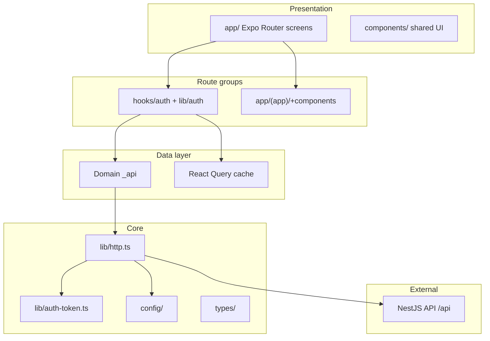
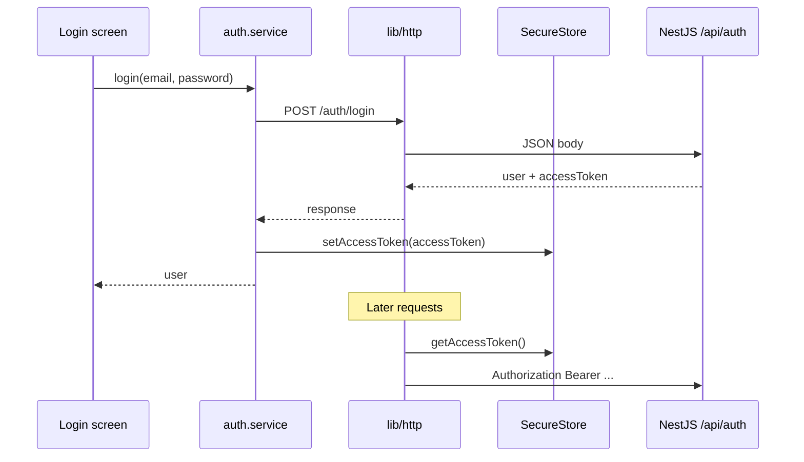

# Jobtracker Mobile — Architecture & Folder Structure

This document defines how the **Expo (React Native)** app should be structured for long-term scale. It is the implementation blueprint for agents and developers.

**Related docs**

| Document | Purpose |
|----------|---------|
| [`Plan.md`](../Plan.md) | Backend auth contract, API routes, mobile integration checklist |
| This file | Mobile app layers, folders, conventions, phased rollout |

**Stack:** Expo SDK 56 · Expo Router · TypeScript · Axios · (recommended) TanStack Query · Expo SecureStore

---

## 1. Design principles

1. **Same API as web** — No forked auth logic on mobile. Use `/api/auth/*` and Bearer tokens per `Plan.md`.
2. **Thin UI, thick boundaries** — Screens compose hooks; hooks call services; services call HTTP. No `axios` in components.
3. **Feature-first folders** — Group by domain (`auth`, `jobs`, …), not by file type at the top level.
4. **Unidirectional dependencies** — `app` → `features` → `services` → `lib` / `config`. Never import screens from `lib`.
5. **Explicit types at API edges** — DTOs and response types live next to the service that uses them.
6. **One HTTP client** — Single axios instance (`src/lib/http.ts`) with interceptors for auth and errors.
7. **Secure token storage** — JWT in **Expo SecureStore**, not AsyncStorage (see `Plan.md` security notes).
8. **Env for URLs only** — `EXPO_PUBLIC_*` for base URL; secrets stay on the server.

---

## 2. High-level architecture



### Layer responsibilities

| Layer | Responsibility | May import |
|-------|----------------|------------|
| **app/*.tsx** routes | Thin screens, navigation | Same group's `+components`; `@/components`, `@/hooks` |
| **app/(domain)/+components** | Domain-local UI | `@/components`, `@/hooks`, `@/constants` |
| **components/** | Shared presentational UI | `@/hooks`, `@/constants` |
| **hooks/** | React logic | `@/lib`, `@/constants` |
| **lib/** | HTTP, SecureStore | `config/*` only |

---

## 3. Authentication (mobile-specific)

Aligned with [`Plan.md`](../Plan.md).

### Flow



### Contract assumptions

| Topic | Mobile approach |
|-------|-----------------|
| Base URL | `{HOST}/api` — e.g. `EXPO_PUBLIC_API_URL=http://10.0.2.2:3000/api` |
| Login / register | `POST /auth/login`, `POST /auth/register` |
| Session | `GET /auth/me` with Bearer |
| Logout | Clear SecureStore + `POST /auth/logout` with Bearer |
| Token in body | **Required** — API must return `accessToken` in JSON (see Plan.md); until then, mobile auth is blocked |
| Refresh | **Not implemented** on API — on 401, clear token and redirect to login (no `/auth/refresh` call) |

### Route protection (Expo Router)

- **Public group:** `app/(auth)/` — login, register
- **Private group:** `app/(app)/` — tabs and main product screens
- **Root layout** loads session once (`GET /auth/me`), then redirects:
  - authenticated → `(app)`
  - unauthenticated → `(auth)`

Do not duplicate JWT validation on the client; trust `/auth/me` and 401 handling.

---

## 4. Folder structure (implemented)

**Rule:** Shared code at `src` top level. Routes under `src/app/`. Each route group has **`+components`** for domain-local UI (Expo Router ignores `+` folders — they are not routes). Layout files use `_layout.tsx` as usual.

```
src/
├── app/                    # Expo Router (screens + layouts only)
│   ├── _layout.tsx
│   ├── index.tsx
│   ├── (auth)/
│   │   ├── login.tsx
│   │   └── +components/    # login-form
│   └── (app)/
│       ├── index.tsx, explore.tsx, _layout.tsx
│       └── +components/    # app-tabs, animated-icon, hint-row
│
├── components/             # Shared UI (themed-*, auth-redirect, ui/)
├── hooks/                  # use-theme, use-color-scheme
│   └── auth/               # use-auth, use-login (domain hooks)
├── constants/              # theme, spacing
├── config/                 # API_URL
├── global/                 # global.css (web fonts)
├── lib/                    # http, auth-token, auth.service
└── providers/              # QueryProvider
```

### Colocation rules

| Location | Contains |
|----------|----------|
| `components/` | Shared across all domains |
| `hooks/`, `hooks/auth/` | Shared + auth session hooks |
| `lib/auth/` | Auth API (no React) |
| `(auth)/+components` | Login form only |
| `(app)/+components` | Tabs, home widgets only |
| `app/*.tsx` | Thin route screens |

### Import examples

```ts
import { ThemedText } from '@/components/themed-text';
import { useAuth } from '@/hooks/auth';
import { LoginForm } from '@/app/(auth)/+components/login-form';
import { AppTabs } from '@/app/(app)/+components/app-tabs';
import { login } from '@/lib/auth';
```

### Naming conventions

| Kind | Pattern | Example |
|------|---------|---------|
| Screen | `kebab` route file | `login.tsx`, `job-detail.tsx` |
| Hook | `use-*.ts` | `use-auth.ts` |
| Service | `*.service.ts` | `auth.service.ts` |
| Types | `*.types.ts` or `types/*.ts` | `auth.types.ts` |
| Feature barrel | `index.ts` | re-export public API |
| Components | PascalCase file | `LoginForm.tsx` → `login-form.tsx` optional; match existing `themed-text.tsx` |

---

## 5. Core modules (detailed)

### 5.1 `config/config.ts`

```ts
// Full API root including global prefix
export const API_URL =
  process.env.EXPO_PUBLIC_API_URL ?? 'http://localhost:3000/api';
```

`.env.example`:

```env
# Physical device: use your machine LAN IP
# Android emulator: http://10.0.2.2:3000/api
EXPO_PUBLIC_API_URL=http://localhost:3000/api
```

### 5.2 `lib/http.ts`

Responsibilities:

- `axios.create({ baseURL: API_URL })`
- **Request interceptor:** attach `Authorization: Bearer <token>` from `auth-token.ts`
- **Response interceptor:** on `401`, clear token and emit event / reject (no fake refresh)
- **Do not** set `withCredentials` on mobile (cookies are for web only)

### 5.3 `lib/auth-token.ts`

- `getAccessToken()`, `setAccessToken(token)`, `clearAccessToken()`
- Implementation: `expo-secure-store`
- Keys as constants in one file (`ACCESS_TOKEN_KEY`)

### 5.4 `lib/api-error.ts`

Map NestJS error bodies to a typed `ApiError`:

```ts
{ statusCode: number; message: string | string[]; error?: string }
```

Services throw or return `Result` — pick one style app-wide (recommend: throw `ApiError`).

### 5.5 `lib/auth/auth.service.ts`

Pure async functions:

| Function | HTTP |
|----------|------|
| `login(dto)` | `POST /auth/login` → store token, return user |
| `register(dto)` | `POST /auth/register` |
| `getMe()` | `GET /auth/me` |
| `logout()` | `clearAccessToken()` + `POST /auth/logout` |

Types in `auth.types.ts`:

```ts
export type User = { id: number; email: string };

export type AuthResponse = {
  user: User;
  accessToken: string; // required once API is updated
};
```

### 5.6 Session state — TanStack Query (`hooks/auth`)

Mirror the web client pattern (`queryKey: ['auth', 'me']`):

| Query key | Query fn | When |
|-----------|----------|------|
| `['auth', 'me']` | `authService.getMe` | App boot, after login/register |
| — | `queryClient.clear()` on logout | |

**Why Query:** caching, loading/error states, refetch, same mental model as `client/`. Alternative: small `AuthProvider` + context if you want zero extra dependency.

### 5.7 `hooks/auth`

- `useAuth()` — wraps `useQuery(['auth', 'me'])`, exposes `{ user, isLoading, isAuthenticated, error }`
- `useLogin()` — `useMutation` → on success invalidate `['auth', 'me']`
- `useRegister()` — same
- `useLogout()` — mutation → clear query cache + token

Screens stay dumb: form state + call mutation hooks.

---

## 6. Routing layout (Expo Router)

```
src/app/_layout.tsx
  └── QueryProvider
  └── Auth bootstrap (useAuth / prefetch me)
  └── Stack
        ├── (auth)/_layout     → Stack, header hidden or minimal
        │     ├── login
        │     └── register
        └── (app)/_layout      → Tabs (existing AppTabs pattern)
              ├── index
              └── explore (or remove template routes)
```

**Redirect rules** (in root or group layouts):

- If `!isAuthenticated` and route is in `(app)` → replace to `/(auth)/login`
- If `isAuthenticated` and route is in `(auth)` → replace to `/(app)`

Use `useSegments()` + `router.replace()` or Expo Router [protected routes](https://docs.expo.dev/router/reference/authentication/) when you adopt SDK patterns.

---

## 7. Dependency rules (enforce mentally or with lint later)

```
app routes       →  app/_*, app/(domain)/_*
app routes       →  +components, @/components, @/hooks
+components      →  @/components, @/hooks, @/constants
hooks/auth       →  @/lib/auth
lib              →  config
```

**Forbidden**

- `lib/` importing from `app/` route screens
- `+components` importing `http` directly
- Route files (`login.tsx`) calling `axios` directly — use `@/lib/auth` + `@/hooks/auth`
- Storing JWT in React state as source of truth (read from SecureStore in interceptor)
- Copy-pasting NestJS auth logic into mobile

---

## 8. Error & loading UX (app-wide)

| Concern | Pattern |
|---------|---------|
| Form validation | Client-side for UX; server messages from `ApiError.message` |
| Global 401 | Interceptor clears token; root layout sends user to login |
| Network offline | Future: optional `NetInfo` banner in `(app)/_layout` |
| Loading | Query `isPending` / mutation `isPending` per screen |

---

## 9. Future domains (placeholder)

When job tracking UI lands, repeat the same pattern:

```
src/features/jobs/
src/services/jobs/
```

Shared list/detail components go in `components/` only if used across features; otherwise keep under `features/jobs/components/`.

---

## 10. Implementation phases

Do these in order. Do not skip phase 0 on the API if `accessToken` is not in the login body yet.

| Phase | Work | Done when |
|-------|------|-----------|
| **0** | API: add `accessToken` to login/register JSON (Plan.md) | Mobile can persist token |
| **1** | `config`, `lib/auth-token`, `lib/http` interceptors, `lib/api-error` | Authenticated axios works |
| **2** | `services/auth`, types | All four auth endpoints callable |
| **3** | `providers/query-provider`, `features/auth` hooks | Session query works |
| **4** | `app/(auth)`, `app/(app)`, root layout guards | Login → home → logout flow |
| **5** | Remove/replace Expo template screens | Product routes only |
| **6+** | Jobs/users features per API modules | Same folder pattern |

---

## 11. Testing strategy (later)

| Layer | Tool |
|-------|------|
| Services | Unit test with mocked axios |
| Hooks | `@testing-library/react-native` + QueryClient wrapper |
| E2E | Detox or Maestro (optional) |

Keep tests colocated: `auth.service.test.ts` next to service file, or `__tests__/` under feature.

---

## 12. Checklist for code reviewers

- [ ] `EXPO_PUBLIC_API_URL` ends with `/api`
- [ ] No secrets in `EXPO_PUBLIC_*`
- [ ] Token only in SecureStore; Bearer via interceptor
- [ ] No `/auth/refresh` until API exists
- [ ] New API access only via `services/*`
- [ ] New screens only under `app/` or `features/*/components`
- [ ] Types for every service request/response

---

## 13. Summary

| Topic | Decision |
|-------|----------|
| HTTP | Axios singleton in `lib/http.ts` |
| Auth transport | Bearer header (not cookies) |
| Token storage | Expo SecureStore |
| API base | `{HOST}/api` via env |
| Structure | `app/` routes + per-domain `+components`; shared `components/`, `hooks/`, `lib/` |
| Session | TanStack Query `['auth', 'me']` (recommended) |
| Routing | `(auth)` / `(app)` route groups |
| Source of truth for auth rules | [`Plan.md`](../Plan.md) |

Implementation work should follow **Section 10** and treat this document as the contract for file placement and imports.
